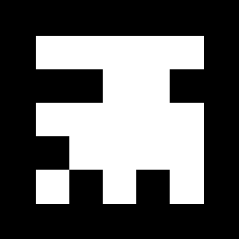

# スケッチの作成

Processingを起動して、新規にスケッチを保存しましょう。
メニューから[ファイル]-[名前を付けて保存]をクリックして、「スケッチフォルダを名前を付けて保存」を開きます。
ファイル名に「Project12」を入力し、[保存]をクリックしましょう。
保存先に「Project12」という名前のフォルダが作成されていることを確認してください。

# NyARToolkitの導入

**ARToolkit**は奈良先端科学技術大学院大学の[加藤研究室](http://imd.naist.jp/index.html)によって
開発された拡張現実（Augumented Reality: AR）のためのソフトウェアです。
拡張現実とは、コンピュータを利用して、現実世界の一部に「仮想的な物体や情報」を重ねて表示することを指します。
この**ARToolkit**のProcessing向けのライブラリが「**[NyARToolkit for Processing](http://nyatla.jp/nyartoolkit/wp/)**」です。

[GitHubのリリースページ](https://github.com/nyatla/NyARToolkit-for-Processing/releases)から、
最新バージョンのNyARToolkitをダウンロードしましょう。
ダウンロードしたファイルはZIPで圧縮されているので解凍し、
解凍後の**library**フォルダをコピーして、「スケッチフォルダ（Project12）」の中に配置しましょう。
コピーしたら、フォルダの名前を**library**から**code**に変更します。
同様に、カメラの設定ファイル**camera_para.dat**も「スケッチフォルダ（Project12）」の中にコピーしておきます。

次に、ソースコードの先頭に「**import jp.nyatla.nyar4psg.&lowast;;**」を入力してください。
また、今回もカメラ映像を利用するため、[スケッチ]-[ライブラリをインポート]-[Video]をクリックして、
Videoライブラリをインポートしておきます。



# カメラ映像の表示

**Capture**クラスを利用して、カメラから入力した画像を表示しましょう。
下記を参考にコードを入力したら、Runボタンをクリックしてください。
ここでは、**サイズ（size）**が**320x240**、**フレームレート（fps）**が**30**となっている、
**3**番のカメラを使用していることに注意してください。
ウィンドウにカメラ映像が表示されることを確認してください。



# 拡張現実の表示

ARToolkitを利用すると、**ARマーカー**と呼ばれる特定のパターンをカメラで読み取ることにより、
その位置を認識し、３Dオブジェクトを配置することができます。
ここでは、NYARToolkitに標準搭載されている**NyID**を利用します。
[NyID](http://sixwish.jp/AR/Marker/idMarker/)には番号が設定されており、
ここではMODEL2の**1番**の[NyID](nyid-m2_id001.png)を利用します。

まずは、下記のように、**MultiMarker**クラスを利用して、利用するマーカーを設定します。
**MultiMarker**クラスのインスタンスを作成するときは、カメラ映像の幅と高さに加え、
カメラのパラメータファイル（**camera_para.dat**）を指定します。
また、対象のNyIDを登録するには、`addNyIDMarker()`関数を利用します。
引数には「**NyIDの番号**」と「**マーカーの物理サイズ（mm）**」を指定します。

	marker = new MultiMarker(this, 320, 240, "camera_para.dat");
	marker.addNyIdMarker(1, 80);

次に、`detect()`関数で、カメラ映像からマーカーを検出し、
`drawBackground()`関数でカメラ映像を背景に設定します。
いずれの関数も引数には**Capture**クラスのインスタンスを渡します。

    marker.detect(cam);
    marker.drawBackground(cam);

最後に、マーカーが検出された場合に、立方体をマーカー上に配置します。
ここで、`beginTransform()`関数によって、原点をカメラに映ったマーカーの中心に変更していることに注意してください。
`endTransform()`関数で、元の座標系に戻ります。

	if(marker.isExist(0)){
     	marker.beginTransform(0);
     	box(50, 50, 50);
     	marker.endTransform();
	}

下記を参考にコードを入力したら、Runボタンをクリックしてください。
マーカーをカメラに映すと立方体が表示されることを確認してください。



カメラ映像を確認すると、マーカーの中心を原点とした立方体を表示するため、
立方体が紙を突き破っていることが分かります。
そこで、`translate()`関数を利用して、立方体の１辺の長さの半分（25）だけ、
Z軸方向にずらしてみましょう。
下記を参考にコードを入力したら、Runボタンをクリックしてください。
立方体がマーカーの表面に乗っているように表示されることを確認してください。



# 課題

マーカーの表面に乗っているように、`sphere()`関数を利用して半径50の球を表示させてください。
課題が完成したら、作成したスケッチを**ZIPアーカイブ**形式で保存します。
ZIPアーカイブを作成するには、メニューから[ツール]-[スケッチをアーカイブ]をクリックして、「スケッチを名前を付けてアーカイブする」を開きます。
保存するファイル名を確認した上で、[保存]をクリックします。
保存先に「Project12-日付a.zip」というファイルが作成されていることを確認してください。

