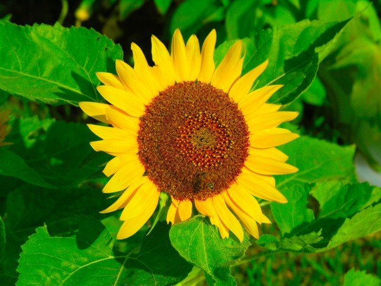
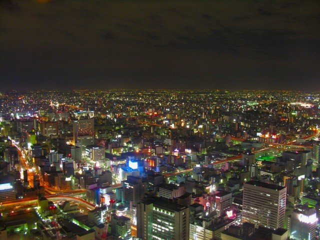
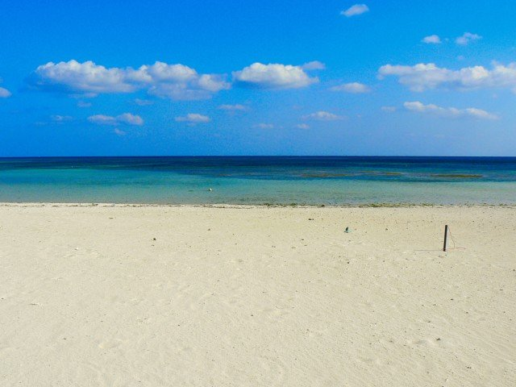

# スケッチの作成

Processingを起動して、新規にスケッチを保存しましょう。
メニューから[ファイル]-[名前を付けて保存]をクリックして、「スケッチフォルダを名前を付けて保存」を開きます。
ファイル名に「Project7」を入力し、[保存]をクリックしましょう。
保存先に「Project7」という名前のフォルダが作成されていることを確認してください。

# 画像の準備

Processingは**JPG形式**や**PNG形式**などの画像ファイルを取り込んで表示することができます。
下記の三種類の画像（[hana.jpg](hana.jpg)、[night.jpg](night.jpg)、[umi.jpg](umi.jpg)）の内から一つを選び、画像をダウンロードしてください（画像提供：[フリー写真素材 Futta.NET](http://www.futta.net/)）。
いずれの画像もサイズは640&times;480ピクセルです。
また、ダウンロードした画像は「スケッチフォルダ（Project7）」の中に配置しましょう。
これ以降、本資料では[hana.jpg](hana.jpg)を例に取り説明していきます。

# 画像の表示

画像ファイルを読み込むには、**PImage**という型（本当はクラス）で変数を宣言し、
`loadIMage()`関数を利用して、変数に画像データを代入します。

    PImage img;
    img = loadImage(ファイル名);

また、ウィンドウに画像を表示するには`image()`関数を用います。
`image()`関数の引数には、**PImage**型の変数に加え、表示する位置**(x,y)**を指定します。
初期設定では、画像の表示位置は、画像の左上隅の座標が基準となることに注意してください。

    image(img, x, y);

下記を参考にコードを入力したら、Runボタンをクリックしてくだい。
ウィンドウに指定した画像が表示されることを確認してください（ウィンドウのサイズは画像サイズと同じ640&times;480ピクセルとします）。



画像をクリッピング（画像の一部を切り取ること）するには、`copy()`関数を利用します。
例えば、画像の左上の1/4の領域を切り取り、幅・高さを2倍にするには下記のように記述します。
(0,0)は元画像の左上隅の座標、(320,240)は切り取る領域の幅と高さを意味しており、これらの値で指定された領域が切り取られます。
また、2度目の(0,0)は切り取った画像を表示する位置、(640, 480)は切り取った画像の幅と高さ（この場合は**拡大**）を意味しています。

    copy(img, 0, 0, 320, 240, 0, 0, 640, 480);

下記を参考にコードを入力したら、Runボタンをクリックしてくだい。
ウィンドウに切り取られた画像が拡大して表示されることを確認してください。



クリッピング機能を利用して**虫眼鏡**を実現してみましょう。
マウスをドラッグすると、マウス位置にある画像部分だけがズームして表示されます。
`mouseDragged()`関数では、`image()`関数で画像を表示した後に、
`copy()`関数を利用して100&times;100ピクセルの領域を切り取り、
200&times;200ピクセル（2倍）に拡大して表示しています。
また、`mouseReleased()`関数では、`image()`関数を実行し、元の画像を表示しています。
下記を参考にコードを入力したら、Runボタンをクリックしてくだい。
ドラッグすると画像が拡大して表示されることを確認してください。



# 配列と画像の色情報

`loadPixels()`関数を実行することで、
画像データを構成する各ピクセルの色情報を取得することができます。
取得された色情報は**pixels[]**という名前の**配列**に記録されます。
**配列**は1つの名前で**複数のデータ**を記録することが可能な特殊な変数と言えます。
例えば、**pixels[0]**、**pixels[1]**のように、配列名の後ろに**[要素番号]**を指定することで、
記録されている値を参照したり、新しい値を代入することができます（要素番号は**0**から始まることに注意してください）。
ここでは、640&times;480ピクセルの画像を対象としているため、要素番号は**0～307199**(＝640&times;480-1)となります。
また、配列の長さは`配列名.length`で参照することができます。
下記を参考にコードを入力したら、Runボタンをクリックしてくだい。
配列の長さである**307200**がコンソールに表示されることを確認してください。



各ピクセルの色成分は、`red()`関数、`green()`関数、`blue()`関数で取り出すことができます。
取り出した各色の成分は**0**から**255**の範囲の値となりますが、**float型**を用いることに注意してください。

    float r = red(img.pixels[要素番号]);
    float g = green(img.pixels[要素番号]);
    float b = blue(img.pixels[要素番号]);

ここでは、赤色（**R**）の成分を残し、緑色（**G**）と青色（**B**）の成分は0にします。
**pixels[]**に色情報を代入するときは`color()`関数を用います。
`color()`関数は引数として、赤色成分、緑色成分、青色成分を指定します。
**pixels[]**に代入した色情報を反映させるには、
`updatePixels()`関数を実行する必要があることに注意してください。

    img.pixels[要素番号] = color(赤色成分, 緑色成分, 青色成分);

下記を参考にコードを入力したら、Runボタンをクリックしてくだい。
赤色成分のみの画像が表示されることを確認してください。



# 課題

画像を**モノクロ**に変換してください。
**モノクロ成分Y**は$$Y = 0.299 \times R + 0.587 \times G + 0.114 \times B$$で求めることができます。
求めた**モノクロ成分Y**を下記のようにして**pixels[]**に代入します。

    img.pixels[要素番号] = color(モノクロ成分);

課題が完成したら、作成したスケッチを**ZIPアーカイブ**形式で保存します。
ZIPアーカイブを作成するには、メニューから[ツール]-[スケッチをアーカイブ]をクリックして、「スケッチを名前を付けてアーカイブする」を開きます。
保存するファイル名を確認した上で、[保存]をクリックします。
保存先に「Project7-日付a.zip」というファイルが作成されていることを確認してください。


